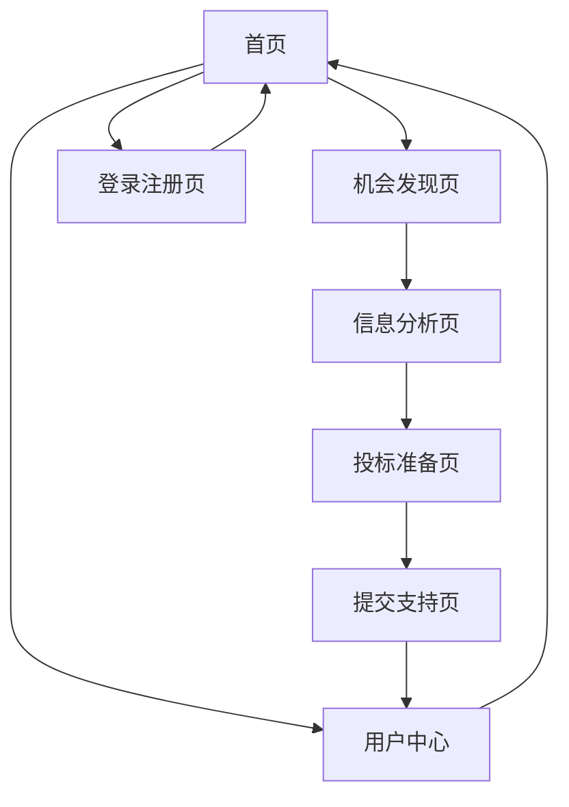

# 招标助手产品需求文档

## 1. Product Overview
招标助手是一个基于AI的智能招投标信息管理平台，帮助供应商、承包商和设计机构高效发现、分析和响应招标机会。
- 解决招标信息分散、筛选困难、文档准备繁琐的问题，为企业提供一站式招投标解决方案。
- 目标是提高招投标成功率，降低信息收集和文档准备成本，助力企业在竞争激烈的招投标市场中获得优势。

## 2. Core Features

### 2.1 User Roles
| Role | Registration Method | Core Permissions |
|------|---------------------|------------------|
| 供应商 | 邮箱注册+企业认证 | 查看招标信息、生成投标文件、风险分析 |
| 承包商 | 邮箱注册+资质验证 | 工程类项目搜索、技术方案生成、竞争分析 |
| 设计机构 | 邮箱注册+作品集验证 | 设计类项目筛选、创意方案制作、客户管理 |

### 2.2 Feature Module
我们的招标助手应用包含以下主要页面：
1. **首页**：搜索入口、热门项目展示、用户引导
2. **机会发现页**：智能搜索、项目列表、筛选条件
3. **信息分析页**：项目详情、风险评估、竞争分析
4. **投标准备页**：文档模板、智能填写、合规检查
5. **提交支持页**：进度跟踪、提醒通知、状态管理
6. **用户中心**：个人信息、企业资料、历史记录
7. **登录注册页**：用户认证、角色选择、权限设置

### 2.3 Page Details
| Page Name | Module Name | Feature description |
|-----------|-------------|---------------------|
| 首页 | 搜索入口 | 提供关键词搜索、地区选择、项目类型筛选功能 |
| 首页 | 热门项目 | 展示最新、热门招标项目，支持快速浏览和收藏 |
| 首页 | 用户引导 | 新用户指引、功能介绍、使用教程 |
| 机会发现页 | 智能搜索 | 基于用户画像和历史行为的个性化项目推荐 |
| 机会发现页 | 项目列表 | 分页展示搜索结果，包含项目基本信息和状态 |
| 机会发现页 | 筛选条件 | 多维度筛选：时间、地区、金额、行业、资质要求 |
| 信息分析页 | 项目详情 | 完整项目信息展示、官方文件下载、关键信息提取 |
| 信息分析页 | 风险评估 | AI分析项目风险点、资质匹配度、成功概率预测 |
| 信息分析页 | 竞争分析 | 竞争对手识别、历史中标情况、市场竞争态势 |
| 投标准备页 | 文档模板 | 提供标准投标文件模板、行业特定模板库 |
| 投标准备页 | 智能填写 | 基于企业信息和项目要求自动填充文档内容 |
| 投标准备页 | 合规检查 | 文档完整性检查、格式规范验证、截止时间提醒 |
| 提交支持页 | 进度跟踪 | 投标进度可视化、关键节点提醒、状态更新 |
| 提交支持页 | 提醒通知 | 截止时间提醒、状态变更通知、结果公布提醒 |
| 提交支持页 | 状态管理 | 投标状态管理、文档版本控制、提交记录 |
| 用户中心 | 个人信息 | 用户基本信息管理、偏好设置、通知配置 |
| 用户中心 | 企业资料 | 企业信息维护、资质证书管理、业绩展示 |
| 用户中心 | 历史记录 | 投标历史、收藏项目、搜索记录、分析报告 |
| 登录注册页 | 用户认证 | 邮箱注册、手机验证、第三方登录、密码找回 |

## 3. Core Process

**主要用户操作流程：**

用户首先在首页进行项目搜索，系统通过智能算法推荐相关招标机会。用户进入机会发现页面，使用多维度筛选条件精确定位目标项目。选定项目后进入信息分析页面，系统提供详细的项目信息、风险评估和竞争分析。确定参与投标后，用户进入投标准备页面，使用智能模板和自动填写功能快速生成投标文件。最后在提交支持页面跟踪投标进度，接收重要提醒和状态更新。

## 4. User Interface Design

### 4.1 Design Style
- **主色调**：专业蓝色(#2563EB)，辅助色为橙色(#F59E0B)和灰色(#6B7280)
- **按钮样式**：圆角矩形按钮，主要按钮使用渐变效果，次要按钮使用边框样式
- **字体**：中文使用思源黑体，英文使用Inter，标题18px，正文14px，说明文字12px
- **布局风格**：卡片式设计，顶部导航栏，左侧功能菜单，响应式网格布局
- **图标风格**：线性图标风格，使用Heroicons图标库，支持主题色彩适配

### 4.2 Page Design Overview

| Page Name | Module Name | UI Elements |
|-----------|-------------|-------------|
| 首页 | 搜索入口 | 大型搜索框居中，渐变背景，下拉选择器，搜索按钮使用主色调 |
| 首页 | 热门项目 | 卡片式布局，3列网格，项目标题、金额、截止时间，收藏按钮 |
| 机会发现页 | 项目列表 | 表格式布局，分页组件，状态标签，操作按钮组 |
| 机会发现页 | 筛选条件 | 侧边栏筛选面板，折叠式分类，多选框，日期选择器 |
| 信息分析页 | 项目详情 | 标签页布局，信息卡片，下载按钮，关键信息高亮显示 |
| 信息分析页 | 风险评估 | 仪表盘样式，进度条，风险等级色彩编码，警告图标 |
| 投标准备页 | 文档模板 | 模板缩略图，分类标签，预览功能，选择按钮 |
| 投标准备页 | 智能填写 | 表单式布局，自动填充提示，保存草稿，实时验证 |
| 提交支持页 | 进度跟踪 | 时间轴样式，步骤指示器，状态图标，进度百分比 |
| 用户中心 | 企业资料 | 表单布局，文件上传组件，预览功能，编辑模式切换 |

### 4.3 Responsiveness
应用采用移动优先的响应式设计，支持桌面端、平板和手机端访问。针对移动端优化触摸交互，增大按钮点击区域，简化导航结构，支持手势操作和下拉刷新功能。