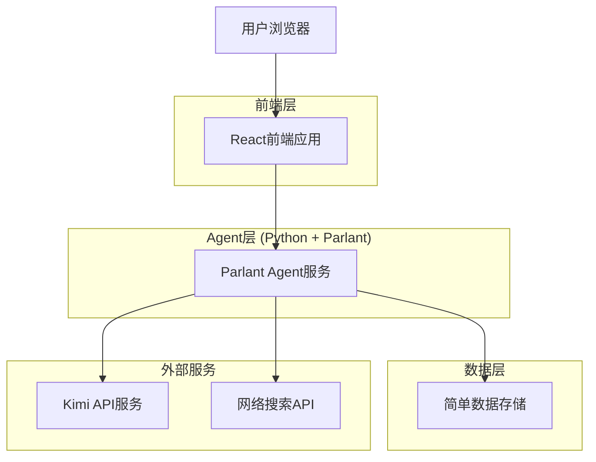
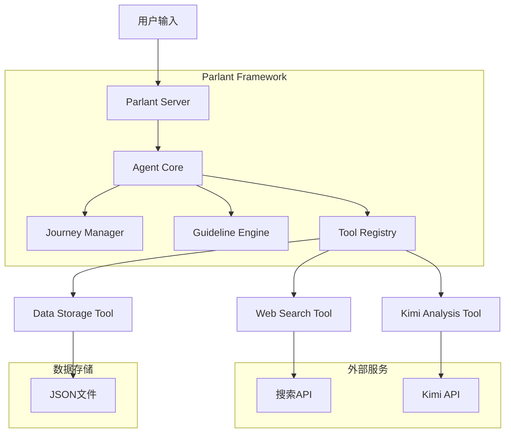

# 招标助手技术架构文档

## 1. Architecture design



## 2. Technology Description

* Frontend: React\@18 + TypeScript + Tailwind CSS\@3 + Vite + parlant-chat-react

* Backend: Python\@3.10+ + Parlant Framework + asyncio

* Database: 简单JSON文件存储 (初期)

* AI Services: Kimi API (通过Parlant集成)

* Search: 网络搜索API (作为Parlant工具)

* Agent Framework: Parlant (用户旅程、指导原则、工具管理)

## 3. Route definitions

| Route            | Purpose          |
| ---------------- | ---------------- |
| /                | 首页，提供搜索入口和热门项目展示 |
| /login           | 登录页面，用户身份验证      |
| /register        | 注册页面，新用户注册和角色选择  |
| /discovery       | 机会发现页，智能搜索和项目列表  |
| /analysis/:id    | 信息分析页，项目详情和风险评估  |
| /preparation/:id | 投标准备页，文档生成和合规检查  |
| /submission      | 提交支持页，进度跟踪和状态管理  |
| /profile         | 用户中心，个人和企业信息管理   |
| /templates       | 模板库，投标文档模板管理     |

## 4. Parlant Agent 配置

### 4.1 Agent 定义

**招标助手Agent**

```python
# main.py
import asyncio
import parlant.sdk as p

async def main():
    async with p.Server() as server:
        agent = await server.create_agent(
            name="BidAssistant",
            description="专业的招投标助手，帮助用户发现机会、分析项目、准备投标文件",
        )
```

### 4.2 用户旅程 (Journeys)

```python
# 定义用户旅程：机会发现 -> 信息分析 -> 投标准备 -> 提交支持
await agent.create_journey(
    name="bid_process",
    steps=[
        "opportunity_discovery",
        "information_analysis", 
        "bid_preparation",
        "submission_support"
    ]
)
```

### 4.3 指导原则 (Guidelines)

```python
# 核心指导原则
await agent.create_guideline(
    condition="用户询问招标信息",
    action="优先从官方来源获取准确信息，保持回复简洁专业"
)

await agent.create_guideline(
    condition="用户需要风险评估",
    action="清晰突出截止时间和风险点，确保合规性"
)
```

### 4.4 工具集成 (Tools)

```python
# 网络搜索工具
@agent.tool
async def web_search(query: str) -> str:
    """搜索招标信息"""
    # 调用网络搜索API
    pass

# Kimi API分析工具  
@agent.tool
async def analyze_project(project_data: str) -> dict:
    """使用Kimi API分析项目"""
    # 调用Kimi API进行智能分析
    pass

# 简单数据存储工具
@agent.tool
async def save_user_data(user_id: str, data: dict) -> bool:
    """保存用户数据到JSON文件"""
    pass
```

## 5. Parlant Agent 架构图



## 6. 简化数据模型 (JSON文件存储)

### 6.1 数据结构定义

**用户会话数据 (sessions.json)**

```json
{
  "session_id": {
    "user_info": {
      "name": "用户名",
      "company": "公司名称",
      "user_type": "supplier/contractor/design_agency",
      "preferences": {}
    },
    "current_journey_step": "opportunity_discovery",
    "context": {
      "search_history": [],
      "current_projects": [],
      "analysis_results": {}
    },
    "created_at": "2024-01-01T00:00:00Z"
  }
}
```

**招标项目缓存 (tenders\_cache.json)**

```json
{
  "projects": [
    {
      "id": "project_001",
      "title": "项目标题",
      "description": "项目描述",
      "region": "地区",
      "industry": "行业",
      "budget": "预算范围",
      "deadline": "截止日期",
      "source_url": "来源链接",
      "cached_at": "2024-01-01T00:00:00Z"
    }
  ]
}
```

**分析结果存储 (analysis\_results.json)**

```json
{
  "project_id": {
    "risk_analysis": {
      "risk_level": "medium",
      "risk_factors": [],
      "recommendations": []
    },
    "competition_analysis": {
      "competitors": [],
      "market_situation": ""
    },
    "qualification_match": {
      "match_score": 0.8,
      "missing_requirements": []
    },
    "analyzed_at": "2024-01-01T00:00:00Z"
  }
}
```

### 6.2 数据操作工具

**Python数据管理工具**

```python
import json
import os
from datetime import datetime
from typing import Dict, Any, List

class SimpleDataStore:
    def __init__(self, data_dir: str = "./data"):
        self.data_dir = data_dir
        os.makedirs(data_dir, exist_ok=True)
    
    def save_session(self, session_id: str, data: Dict[str, Any]):
        """保存会话数据"""
        file_path = os.path.join(self.data_dir, "sessions.json")
        sessions = self.load_json(file_path, {})
        sessions[session_id] = data
        self.save_json(file_path, sessions)
    
    def load_session(self, session_id: str) -> Dict[str, Any]:
        """加载会话数据"""
        file_path = os.path.join(self.data_dir, "sessions.json")
        sessions = self.load_json(file_path, {})
        return sessions.get(session_id, {})
    
    def cache_tenders(self, projects: List[Dict[str, Any]]):
        """缓存招标项目"""
        file_path = os.path.join(self.data_dir, "tenders_cache.json")
        data = {
            "projects": projects,
            "cached_at": datetime.now().isoformat()
        }
        self.save_json(file_path, data)
    
    def save_analysis(self, project_id: str, analysis: Dict[str, Any]):
        """保存分析结果"""
        file_path = os.path.join(self.data_dir, "analysis_results.json")
        results = self.load_json(file_path, {})
        results[project_id] = analysis
        self.save_json(file_path, results)
    
    def load_json(self, file_path: str, default: Any = None) -> Any:
        """加载JSON文件"""
        try:
            with open(file_path, 'r', encoding='utf-8') as f:
                return json.load(f)
        except (FileNotFoundError, json.JSONDecodeError):
            return default or {}
    
    def save_json(self, file_path: str, data: Any):
        """保存JSON文件"""
        with open(file_path, 'w', encoding='utf-8') as f:
            json.dump(data, f, ensure_ascii=False, indent=2)
```

